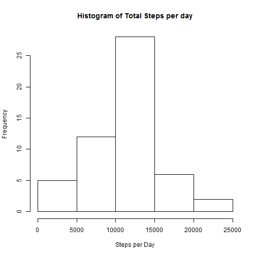
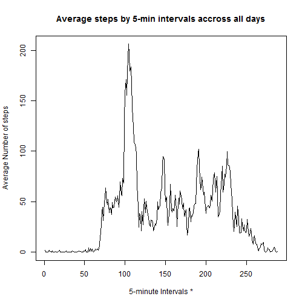
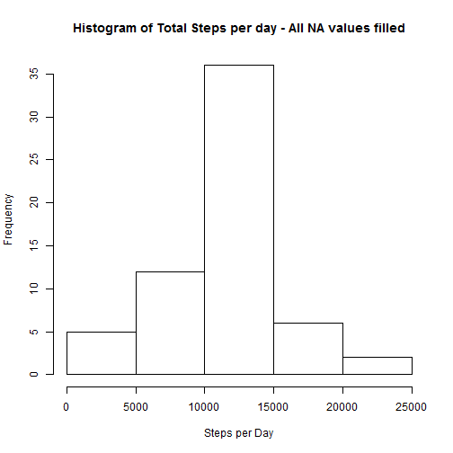
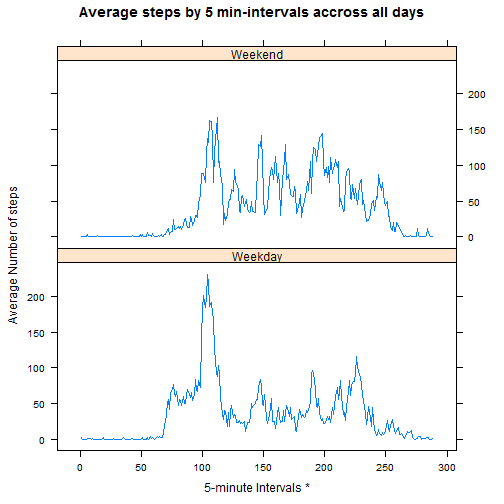

This assignment makes use of data from a personal activity monitoring device. This device collects data at 5 minute intervals through out the day. The data consists of two months of data from an anonymous individual collected during the months of October and November, 2012 and include the number of steps taken in 5 minute intervals each day. 

The data for the assignment is in the zipped file ../activity.zip which has the file activity.csv  

### Loading and preprocessing the data

#### 1. Load the data


```r
rawdata <- read.csv(unz("activity.zip", "activity.csv"))
```

#### 2.  Process/transform the data (if necessary) into a format suitable for your analysis


```r
# Create a new data set with the date column converted to class "date" 
prepdata <- rawdata
prepdata$date <- as.Date(prepdata$date)
```

### What is mean total number of steps taken per day?

#### 1.  Calculate the total number of steps taken per day


```r
# For this part of the assignment, ignoring the missing values in the dataset
prepdata1 <- prepdata[!is.na(prepdata$steps),]

# Calculate the total number of steps taken per day
sd <- aggregate(prepdata1["steps"], by=prepdata1[c("date")], FUN=sum)
```

#### 2. Histogram of the total number of steps taken each day


```r
hist(sd$steps, xlab="Steps per Day", main="Histogram of Total Steps per day")
```

 

#### 3. mean and median of the total number of steps taken per day:


```r
mean(sd$steps)
```

```
## [1] 10766.19
```

```r
median(sd$steps)
```

```
## [1] 10765
```


### What is the average daily activity pattern?

#### 1.  Make a time series plot (i.e. type = "l") of the 5-minute interval (x-axis) and the average number of steps taken, averaged across all days (y-axis)


```r
# First, calculate the Average steps for each 5 min-interval accross all days

si <- aggregate(prepdata1["steps"], by=prepdata1[c("interval")], FUN=mean)
colnames(si)[2]<-"meanSteps"

# Now, create the time series plot 
# x-axis displays the 288 5-minute intervals that exist during a day, and not the interval identifiers (0 to 2355)

plot(rownames(si),si$meanSteps,type="l",main="Average steps by 5-min intervals accross all days", xlab="5-minute Intervals *",ylab="Average Number of steps", axes=FALSE)
axis(side=1, at=seq(0, 290, by=50))
axis(side=2, at=seq(0,200, by=50))
box()
```

 

 
```
* Note that x-axis displays the 288 5-minute intervals that exist during a day, and not the interval identifiers (0 to 2355)

```

---------------------------------


#### 2.  Which 5-minute interval, on average across all the days in the dataset, contains the maximum number of steps?


```r
# get row that has the interval with the max average steps, get the interval number and convert it to time of the day  

intervalMax <- rownames(si[which.max(si$meanSteps),])
time <- si[which.max(si$meanSteps),"interval"]
hours <- as.integer(time/100)
minutes <- (time/100 - as.integer(time/100))*100
```


Interval number 104 has on average accross all days, the maximum number of steps during the day. This interval corresponds to the 5 minutes period that starts at 8:35.


---------------------------------

### Inputing missing values

#### 1.  Calculate and report the total number of missing values in the dataset (i.e. the total number of rows with NAs)


```r
## total number of missing values in the dataset 

numberNARows <- nrow(rawdata[is.na(rawdata),])
```


The total number of missing values in the data set is: 2304.

---------------------------------

#### 2. Strategy for filling in all of the missing values in the dataset

 
For each row with missing (NA) values in "steps", and based on the "interval" of the row, the number of steps for that same interval averaged over all days where there are no NA's will be used.


---------------------------------

#### 3.  Create a new dataset that is equal to the original dataset but with the missing data filled in.


```r
prepdata2 <- prepdata #prepdata has the original dataset, prepdata2 will have the new dataset

##before merging save
prepdata2$rn <- as.numeric(row.names(prepdata2)) # Save row names because merge changes row names and order. 

b <-merge(prepdata2, si, by = "interval", all.y=TRUE, sort=FALSE)
b[is.na(b$steps),"steps"] <- b[is.na(b$steps),"meanSteps"]

## after merging restore 
b <- b[order(b$rn),] # Reorder the merged dataset using original row names
rownames(b) <- b$rn  # restore row names
prepdata2 <- b[,c("steps","date","interval")] 
```

---------------------------------

#### 4. Make a histogram of the total number of steps taken each day


```r
# Calculate the total number of steps taken per day
sd2 <- aggregate(prepdata2["steps"], by=prepdata2[c("date")], FUN=sum)

hist(sd2$steps, xlab="Steps per Day", main="Histogram of Total Steps per day - All NA values filled")
```

 


Note that more days have now an average of steps per day between 10000 and 15000 (frequency increased compared to previous histogram), this is because 8 new days were added when filling in NAs, each with a number of steps equal to the previous average number of steps, which was a number in this range. 

---------------------------------


#### 5. mean and median of the total number of steps taken per day:


```r
## Mean and Median steps accross all days

mean(sd2$steps)
```

```
## [1] 10766.19
```

```r
median(sd2$steps)
```

```
## [1] 10766.19
```

---------------------------------

#### 6. Do these values differ from the estimates from the first part of the assignment? What is the impact of imputing missing data on the estimates of the total daily number of steps?


The mean of steps per day does not change after filling in NA's. This is because of the formula used. The days where values were missing were filled in with mean values of all other days, so the total steps for those days was the same as the average total steps for the  other values, and the overall mean was not affected.    

The median of steps per day interval changed a bit after filling in NA's. This is becuase more dates were introduced all with a value a bit higher than the previous median, this moved the median up.


---------------------------------

### Are there differences in activity patterns between weekdays and weekends?

#### 1. Create a new factor variable in the dataset with two levels - "weekday" and "weekend" indicating whether a given date is a weekday or weekend day.


```r
prepdata3 <- prepdata2 # prepdata2 has the dataset with NA's filled
prepdata3$typeDay <-as.factor(gsub("^Monday|^Tuesday|^Wednesday|^Thursday|^Friday","Weekday",gsub("^Sunday|^Saturday", "Weekend",weekdays(prepdata2$date))))
```

---------------------------------

#### 2.  Make a panel plot containing a time series plot (i.e. type = "l") of the 5-minute interval (x-axis) and the average number of steps taken, averaged across all weekday days or weekend days (y-axis)


```r
# first calculating the 5-min interval number to be used as x-axis (numbers between 1 and 288)
# x-axis will display the 288 5-minute intervals that exist during a day, and not the interval identifiers (0 to 2355)

prepdata3$fiveMinutesInterval <- ((as.integer(prepdata3$interval/100)*60 + ((prepdata3$interval/100 - as.integer(prepdata3$interval/100))*100))/5)+1

# then calculate Average steps by Type of Day and interval accross all days

si2 <- aggregate(prepdata3["steps"], by=prepdata3[c("typeDay","fiveMinutesInterval")], FUN=mean)

# plot
require(lattice)
```

```
## Loading required package: lattice
```

```r
xyplot(steps~fiveMinutesInterval|typeDay, si2, type='l', main="Average steps by 5 min-intervals accross all days", xlab="5-minute Intervals *", ylab="Average Number of steps", layout = c(1,2) )
```

 


 
```
* Note that x-axis displays the 288 5-minute intervals that exist during a day, and not the interval identifiers (0 to 2355)

```

---------------------------------
